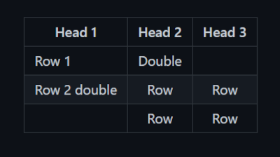
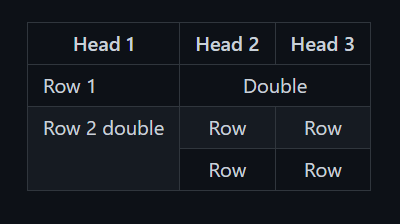

# JustFTables
Just a minimal extension that fixes a very annoying limitation: seamless column and row merging for Obsidian tables.

> ⚠️ **Note:** The merged layout is rendered and visible **only in Reading View**. In Live Preview or Source mode, you will see the raw syntax.

## Example
Without extension: <br>


With extension:<br>


## How to use it

### Merging Columns (`colspan` - sideways)
To merge a cell horizontally across multiple columns, start the cell text with **`->` followed immediately by a number** indicating how many columns to span (e.g., `->2`, `->3`).

**Example Markdown:**
```markdown
| Header 1 | Header 2 | Header 3 |
| :--- | :--- | :--- |
| ->2 Merged across two columns |   |Normal cell |
```

### Merging Rows (`rowspan` - downwards)
To merge a cell vertically down across multiple rows, start the cell text with **`-/`** followed immediately by a number indicating how many rows to span (e.g., `-/2`, `-/3`).

**Example Markdown:**
```markdown
| Header 1 | Header 2 |
| :--- | :--- |
| -/2 Spans 2 rows down | Normal cell |
|                      | Another cell |
```

## Commands

The following commands are available via the Obsidian Command Palette (Ctrl/Cmd+P):

- **`JustFTables: Add example fixed table`**: Creates a sample table, making it easier to get familiar with how the extension works.
- **`JustFTables: Show version`**: Shows the currently installed version.

